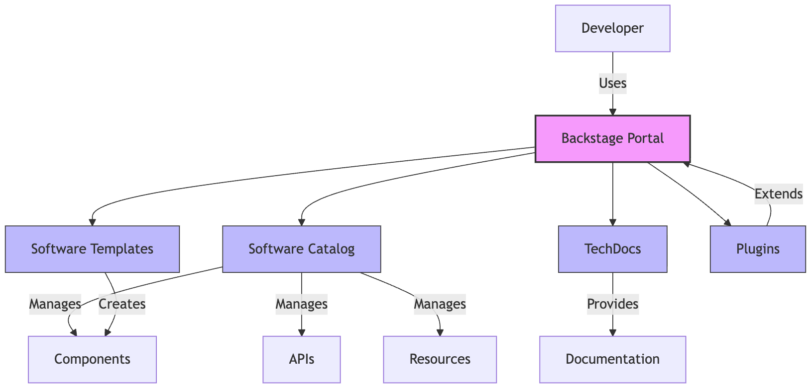

# Getting Started with Backstage

## What is Backstage?

Backstage is an open-source developer portal platform created by Spotify. It provides a centralized place for all your tools, services, and documentation, making it easier for developers to find what they need and follow best practices.



Backstage consists of several key components:

1. **Software Catalog**: A centralized inventory of all your software assets
2. **TechDocs**: Documentation system that follows a "docs-like-code" approach
3. **Software Templates**: Standardized templates for creating new services
4. **Plugins**: Extensible components that add functionality to Backstage

## Installing Backstage

Let's start by installing a vanilla Backstage instance. This will give you a working platform that you can later customize to your needs.

### Prerequisites

Make sure you have the following installed:

- Node.js (version 16 or later)
- Yarn
- Git

### Step 1: Create a New Backstage App

Open your terminal and run the following command:

```bash
# Create a new Backstage app
npx @backstage/create-app@latest
```

This command will prompt you for some information:

1. Enter a name for your app (e.g., `my-backstage-app`)
2. Choose if you want to use the default template (select "Yes" for this exercise)

The command will create a new directory with your app name and install all the necessary dependencies. This might take a few minutes.

### Step 2: Start Your Backstage App

Once the installation is complete, navigate to your app directory and start the development server:

```bash
# Navigate to your app directory
cd my-backstage-app

# Start the app
yarn dev
```

!!! tip "Node.js 20+ Users"
    If you're using Node.js 20 or later, you'll need to set the `NODE_OPTIONS` environment variable:
    ```bash
    export NODE_OPTIONS="--no-node-snapshot"
    yarn dev
    ```

### Step 3: Access Your Backstage App

Once the server has started, open your browser and navigate to:

```
http://localhost:3000
```

You should see the Backstage welcome page. Congratulations! You now have a running Backstage instance.

## Exploring Your Backstage Instance

Take a moment to explore the default Backstage interface:

1. **Home Page**: The landing page with an overview of your Backstage instance
2. **Catalog**: Where all your software components will be listed
3. **APIs**: A catalog of APIs in your organization
4. **Docs**: Documentation for your components
5. **Create...**: Tools for creating new components or registering existing ones

## Configuring Authentication

By default, your Backstage instance uses a guest user. For a real-world setup, you'll want to configure proper authentication. Let's set up GitHub authentication:

### Step 1: Create a GitHub OAuth App

1. Go to your GitHub account settings
2. Navigate to "Developer settings" > "OAuth Apps" > "New OAuth App"
3. Fill in the details:
   - Application name: "My Backstage App"
   - Homepage URL: "http://localhost:3000"
   - Authorization callback URL: "http://localhost:7007/api/auth/github/handler/frame"
4. Click "Register application"
5. Generate a new client secret

### Step 2: Configure Backstage

Open the `app-config.yaml` file in your Backstage app directory and add the following configuration:

```yaml
auth:
  environment: development
  providers:
    github:
      development:
        clientId: ${AUTH_GITHUB_CLIENT_ID}
        clientSecret: ${AUTH_GITHUB_CLIENT_SECRET}
```

### Step 3: Set Environment Variables

Create a `.env` file in your Backstage app directory with your GitHub OAuth credentials:

```bash
AUTH_GITHUB_CLIENT_ID=your-client-id
AUTH_GITHUB_CLIENT_SECRET=your-client-secret
```

### Step 4: Restart Your Backstage App

Stop your running Backstage instance (Ctrl+C) and start it again:

```bash
yarn dev
```

Now you should be able to log in with your GitHub account.

## Next Steps

Now that you have a running Backstage instance with authentication configured, let's move on to adding components to the Software Catalog.
