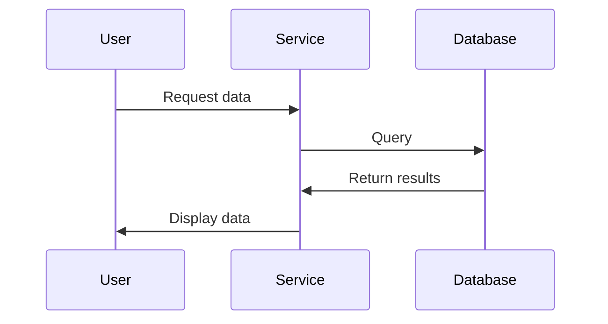

# Adding Documentation with TechDocs

## What is TechDocs?

TechDocs is Backstage's built-in documentation system that follows a "docs-like-code" approach. Your documentation is written in Markdown, stored alongside your code, and rendered as a beautiful technical documentation site directly in Backstage.

## Quick Setup

### Step 1: Install Dependencies

TechDocs requires Python and MkDocs to generate documentation:

```bash
# Install Python and pip
brew install python  # macOS
# OR
sudo apt install python3 python3-pip  # Ubuntu/Debian

# Install MkDocs and plugins
pip install mkdocs mkdocs-material mkdocs-techdocs-core==1.2.1
```

### Step 2: Add Documentation to Your Repository

In your `backstage-demo` repository that we created earlier:

1. Create a docs directory and basic files:

```bash
cd backstage-demo
mkdir -p docs

# Create mkdocs.yml configuration
cat > mkdocs.yml << 'EOF'
site_name: 'My Service'
site_description: 'Documentation for My Service'

nav:
  - Home: index.md
  - Getting Started: getting-started.md

plugins:
  - techdocs-core

markdown_extensions:
  - admonition
  - pymdownx.details
  - pymdownx.superfences
  - pymdownx.highlight
  - pymdownx.tabbed
  - pymdownx.emoji
EOF

# Create a simple home page
cat > docs/index.md << 'EOF'
# My Service

Welcome to the documentation for My Service!

## Overview

This service provides important functionality for our system.

## Features

- Feature 1: Does something amazing
- Feature 2: Solves a critical problem
- Feature 3: Makes developers happy

## Quick Links

- [Getting Started](getting-started.md)
EOF

# Create a getting started page
cat > docs/getting-started.md << 'EOF'
# Getting Started

This guide will help you get started with My Service.

## Installation

```bash
# Clone the repository
git clone https://github.com/YOUR_USERNAME/backstage-demo.git
cd backstage-demo

# Install dependencies
npm install
```

## Basic Usage

```javascript
// Import the service
import { MyService } from './service';

// Initialize
const service = new MyService();

// Use the service
service.start();
```
EOF
```

### Step 3: Update Your catalog-info.yaml

Make sure your `catalog-info.yaml` includes the TechDocs annotation:

```yaml
apiVersion: backstage.io/v1alpha1
kind: Component
metadata:
  name: backstage-demo
  description: A demo component for Backstage
  annotations:
    github.com/project-slug: YOUR_USERNAME/backstage-demo
    backstage.io/techdocs-ref: dir:.  # This enables TechDocs
spec:
  type: service
  lifecycle: experimental
  owner: user:guest
```

### Step 4: Commit and Push

```bash
git add mkdocs.yml docs/ catalog-info.yaml
git commit -m "Add TechDocs documentation"
git push
```

## Viewing Your Documentation

1. Go to your Backstage instance (http://localhost:3000)
2. Navigate to the Catalog and find your component
3. Click on the "Docs" tab

You should now see your documentation rendered beautifully in Backstage!

### Adding TechDocs Addons

TechDocs supports addons that enhance the documentation experience. To add them:

1. Install the required packages:

```bash
yarn add @backstage/plugin-techdocs-react @backstage/plugin-techdocs-module-addons-contrib
```

2. Update your App.tsx to include the addons:

```tsx
import { TechDocsAddons } from '@backstage/plugin-techdocs-react';
import { ReportIssue } from '@backstage/plugin-techdocs-module-addons-contrib';

// Inside your AppRoutes component
<Route 
  path="/docs/:namespace/:kind/:name/*" 
  element={<TechDocsReaderPage />}
>
  <TechDocsAddons>
    <ReportIssue />
  </TechDocsAddons>
</Route>
```

This adds a "Report Issue" button that allows users to create GitHub issues directly from the documentation.

## Making Documentation Valuable

Great documentation includes:

1. **Clear Overview**: What the component does and why it exists
2. **Getting Started**: Simple steps to start using the component
3. **API Reference**: If applicable, document your APIs
4. **Examples**: Real-world usage examples
5. **Troubleshooting**: Common issues and solutions

## Enhancing Your Docs

### Add Diagrams

Mermaid diagrams help visualize concepts:

```markdown

```

### Add Admonitions

Highlight important information:

```markdown
!!! tip "Pro Tip"
    This feature works best when combined with X.

!!! warning "Caution"
    Remember to validate user input.
```

### Add Tables

Organize structured information:

```markdown
| Feature | Basic | Pro | Enterprise |
|---------|:-----:|:---:|:----------:|
| Feature A | ✓ | ✓ | ✓ |
| Feature B | | ✓ | ✓ |
| Feature C | | | ✓ |
```

## Next Steps

Now that you've set up TechDocs for your component:

1. **Expand your documentation** with more detailed guides
2. **Configure TechDocs** for production (cloud storage, CI/CD integration)
3. **Create documentation templates** for your organization

Remember: Good documentation reduces support burden and helps new team members get up to speed quickly!
