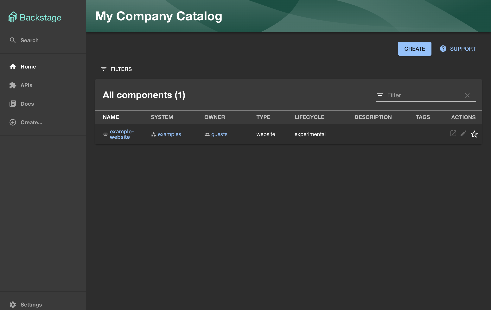

# Setup Backstage Dev Environment

## Getting Started

We are going to start by checking the repository out locally.

Afterwards, you can simply open the checked out folder in Visual Studio Code.  
If the Dev Container extension is properly installed, the left bottom of the IDE will show "Dev Container:"


## Creating a new Backstage app

Once you have a running environment you will now need to create a new backstage
app and get it started. To do this we have to use an `npx` command that will use
the backstage scaffolder to create a new backstage app.

Open the vscode terminal and run the following command and answer the questions
when prompted, accept all defaults.

```bash
npx @backstage/create-app@latest --path backstage
```

In this command we specify the path to create the app in, which is normally
optional but needed within our setup as the backstage folder will already exists
due to container mounts.

This command will take a few minutes to run as it scaffolds the ann and restores
all the packages using yarn.

Once it is complete, we can start the development environment by running the
following command:

```bash
yarn start
```



Once you have a running installation we can move to the first exercise (make
sure you read the note on Authentication below first!). In case you don't see
the Backstage app running, please check the following:

??? Note "Working Directory"

    Ensure you are in the `backstage` directory when running the above command.
    All of the commands in this workshop should be run from the `backstage` directory.

??? Note "Port mapping"

    Backstage is running two processes exposed in the the container on port 3000
    and 7007. The codespace is mapping the ports to your local ports. Ensure
    you have no other processes running on those ports and both ports are mapped, you may have to manually add port 7007 in the vscode UI.

!!! Warning "Known macOS issue"
    
    Backstage has a known issue on macOS that causes the backstage website to not load, see [here](https://github.com/backstage/backstage/issues/24888). To work around this, please go to `backstage/app-config.yaml` and update the `app` block by explicitly setting the host:
    ```
    app:
        title: Scaffolded Backstage App
        baseUrl: http://localhost:3000
        listen:
            host: 0.0.0.0
    ```

## Authentication

For this workshop we will need to authenticate with GitHub in order to create
new repositories in organizations that you own. To do this we need a token for
GitHub. We can re-use the token from the GitHub CLI for these purposes, this is
the easiest way to get a token and the token is short lived.

Before we can continue we need to stop the running backstage app, you can do
this by pressing `ctrl+c` in the terminal where the app is running. Next we use
the same terminal session to authenticate with GitHub.

The GitHub CLI is already installed in this codespace, first you need to login.

```bash
unset GITHUB_TOKEN
gh auth login
```

Follow the prompts in the terminal and you should see
`✓ Logged in as <USERNAME>` when successful.

We need to export the token to the command line to enable it to be used in the
backstage app.

```bash
export GITHUB_TOKEN=$(gh auth token)
```

!!! tip "Terminal Sessions"

    This token will only be available in the current terminal session, if you
    close the terminal (or open a new one) you will need to re-run the above
    export command to export the token.
