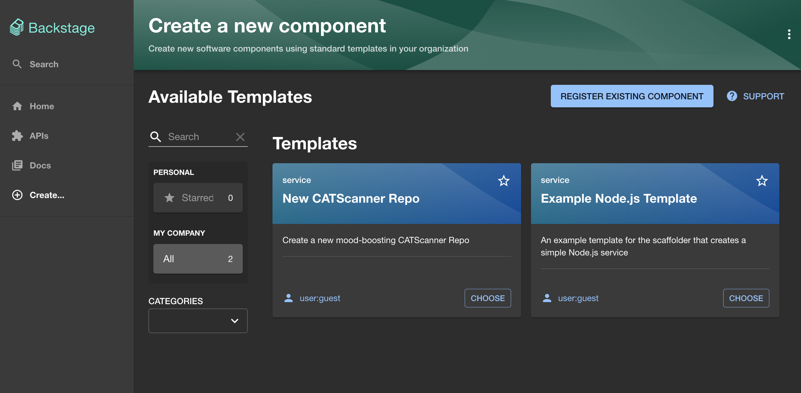
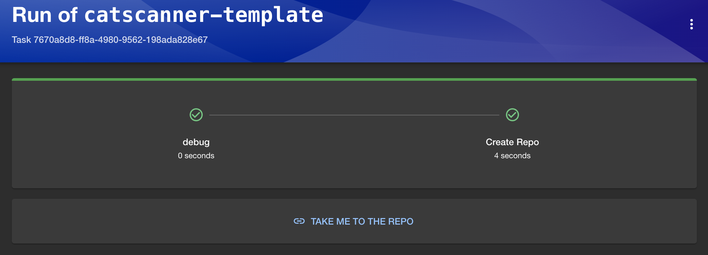

# Part 1 - Creating a template

In this exercise we will create a new template for your Backstage instance. This
will be a simple template that will be used to create a new repository in
GitHub.

Firstly, we need to create a new folder containing a yaml file in our backstage
installation. We can call this `examples/catscanner/template.yaml` This file
will contain our template.

```bash
cd backstage
mkdir -p examples/catscanner && touch examples/catscanner/template.yaml
```

We can then start by adding some basic template configuration to the file. Like
so:

```yaml
apiVersion: scaffolder.backstage.io/v1beta3
kind: Template
metadata:
  name: catscanner-template
  title: New CATScanner Repo
  description: Create a new mood-boosting CATScanner Repo
spec:
  owner: user:guest
  type: service

  # These parameters are used to generate the input form in the frontend, and are
  # used to gather input data for the execution of the template.
  parameters:
    - title: Create a new repo
      required:
        - repoUrl
      properties:
        repoUrl:
          title: Repository Location
          type: string
          ui:field: RepoUrlPicker
          ui:options:
            allowedHosts:
              - github.com

  # These steps are executed in the scaffolder backend, using data that we gathered
  # via the parameters above.
  steps:
    - id: debug
      name: debug
      action: debug:log
      input:
        message: Hello World

  # Outputs are displayed to the user after a successful execution of the template.
  output:
    links:
      - title: Take me to the repo
        url: ${{ steps['create-repo'].output.remoteUrl }}
```

This template will ask for a new repo name and then simply log `Hello World` to
the log when executed.

To make this template show up in our backstage instance we need to add the
location to our `app-config.yaml`. This tells backstage where to look for this
file. You can add a new location under `catalog.locations` like below:

```yaml
- type: file
  target: ../../examples/catscanner/template.yaml
  rules:
    - allow: [Template]
```

You can then start your backstage instance and you should see the new template
in the [templates section](http://localhost:3000/create?filters%5Bkind%5D=template&filters%5Buser%5D=all).



## Creating a repo

Now that we have a skeleton of our template we can enhance it to make it create
a repo for us.

There are a number of built in actions that we can take advantage of in our
templates, but they are not all installed by default. To be able to create a
GitHub repo, we need to install some GitHub actions into our backstage instance.
First we need to install the plugin package using yarn:

```bash
cd packages/backend
yarn add @backstage/plugin-scaffolder-backend-module-github
```

Then we then need to tell backstage to import this module into the backend,
which will automatically register the actions and make them available to us. We
need to add the following in `packages/backend/src/index.ts`

```typescript
backend.add(import("@backstage/plugin-scaffolder-backend-module-github"));
```

Now, we can then use the actions we just installed in our template and create a
a new repo using the `publish:github` action. Add the following to your
`template.yaml` in the `spec.steps` section:

```yaml
- id: create-repo
  name: Create Repo
  action: publish:github
  input:
    repoUrl: ${{ parameters.repoUrl }}
```

!!! tip "Refreshing Template Changes"

    The changes may not be immediately visible. You can the refresh the template
    by going to the catalog, changing the "kind" filter to "Template", clicking
    on your template and then clicking the refresh button in the about card.

Now, go to your template, enter the repo details and it should create a new repo
in GitHub for you. Use for "owner" your GitHub handle and choose a name for the repository. Once finished the template displays a link (TAKE ME TO THE REPO) to the newly created (private) repository.



After this point we do not need the newly created repository anymore, so you can delete it in GitHub.

??? Warning "Authentication"

    Authentication is needed to enable your backstage to log into GitHub and
    create your repo. If you are having issues go back to the Authentication
    section in Getting Started and ensure you have a valid token. You will only
    be able to make repos in an org that you have access to create public repos.

!!! tip "Installed actions"

    The above package installed a lot more actions than just the `publish:github`,
    [you can browse the rest of the available templates here](http://localhost:3000/create/actions).
