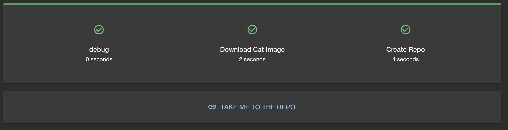

# Part 2 - Creating a new action

In this exercise we will create a new action for Backstage. Custom actions allow
us to extend the functionality of Backstage to do whatever we need as part of a
template. They are re-usable steps that can be used in multiple templates.

Our new action will allow us to get a random cat picture. It will call the Cat
API to get the location of a cat photo, download the file and place it in the
working directory.

There are 4 steps to creating a new action:

1. Create a new scaffolder plugin
2. Register your plugin
3. Write your action
4. Use it in the template

## Create a new scaffolder plugin

To create a new scaffolder we can leverage the backstage templates by running

```bash
cd backstage
yarn new --select scaffolder-backend-module
```

This will create a new scaffolder module in the `plugins` directory. You can
name the plugin whatever you like, for this example we will call it
`cat-scaffolder`.

Congratulations, you have created a new scaffolder plugin!

!!! tip

    You can see what other plugin types there are by running `yarn new`.

You will see that the plugin is automatically added to the `package.json` in
`packages/backend` as a dependency. This is because the new plugin is a backend
plugin.

It will also be automatically imported in the `packages/backend/src/index.ts`
file so its ready to use straight away.

To confirm everything is working correctly you can now run `yarn start` to start
backstage, navigate to [Installed Actions](http://localhost:3000/create/actions)
and you should see `acme:example` in the list. (we will change this later!)

!!! Warning "Broken module.ts"

    As of the time of writing this workshop, there's a bug in the plugin generator.
    Please go to `plugins/scaffolder-backend-module-cat-scaffolder/src/module.ts` and update the following import:
    ```
    // before
    import { scaffolderActionsExtensionPoint } from '@backstage/plugin-scaffolder-node/alpha';

    // after
    import { scaffolderActionsExtensionPoint } from '@backstage/plugin-scaffolder-node';
    ```

## Write your action

Now we need to write our action. This is the code that will be executed when the
action is run as part of a template. We are going to use `example.ts` in our
plugin as a starting point.

First, update the definition of the action, changing the ID and description and
removing the required inputs and properties definitions. We don't need them
(yet). Your call to `createTemplateAction` should something look like this:

```typescript
...
  return createTemplateAction<{
    myParameter: string;
  }>({
    id: "catscanner:randomcat",
    description: "Downloads a random cat image into the workspace",
    schema: {
      input: {
        type: "object",
        required: [],
        properties: {},
      },
    },
    async handler(ctx) {
      ctx.logger.info(
        `Running example template with parameters: ${ctx.input.myParameter}`
      );

      await new Promise((resolve) => setTimeout(resolve, 1000));
    },
  });
...
```

Now need to implement the action code in the `handler` function in
`src/actions/example/example.ts`,. This is where we get the cat image from the
API and download it to the working directory.

The API that we will use is `https://api.thecatapi.com/v1/images/search`, this
API will return a JSON object with a URL to a cat image. Once we get this json,
we then need to download this image and save it to the working directory.

You can access the working directory using `ctx.workspacePath` and write to the
log using `ctx.logger.info`.

!!! tip "Unit Testing"

    You can and should write unit tests for your action using the
    [instructions in the backstage docs](https://backstage.io/docs/features/software-templates/writing-tests-for-actions).

## Use it in a template

Now that we have our action we can use it in a template.

You can add this action to the template by adding the following to the
`spec.steps` section of the template yaml file:

```yaml
- id: download-cat-image
  name: Download Cat Image
  action: catscanner:randomcat
```

You can now test your cat downloading skills in the template! You should end up
with a repo that has a single cat image in it.

!!! tip "Don't forget to refresh your template!"

??? tip "Hint"

    Ensure you place the steps in the correct order. After running the automation
    you should see all the steps executed as well a link to the newly created repository.

    

## Bonus Round - Testing

If you have not already you should try writing unit test for your new action
using the
[instructions in the backstage docs](https://backstage.io/docs/features/software-templates/writing-tests-for-actions).

You can see that the template was generated with an example unit test already
setup as an example for you
